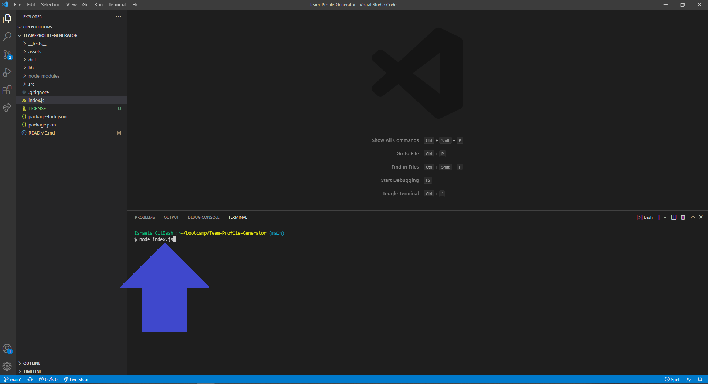
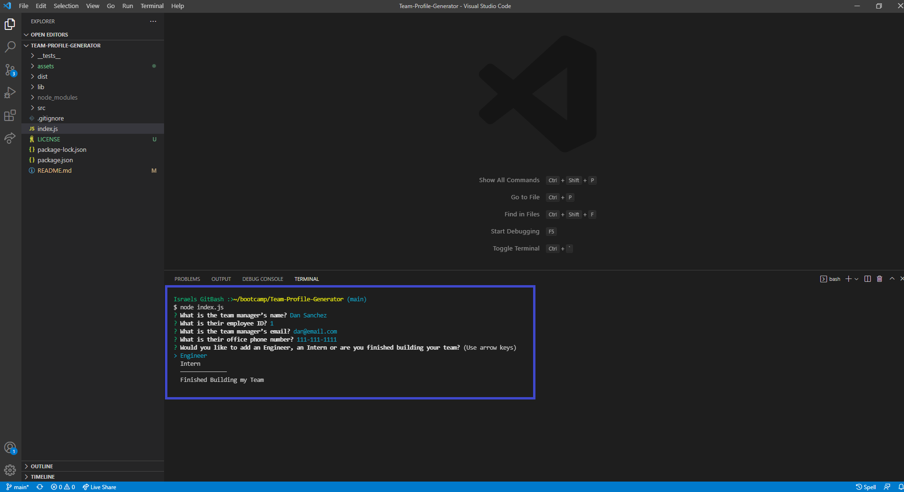
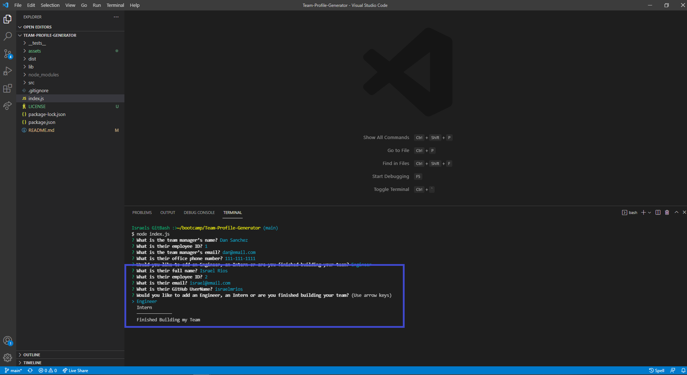
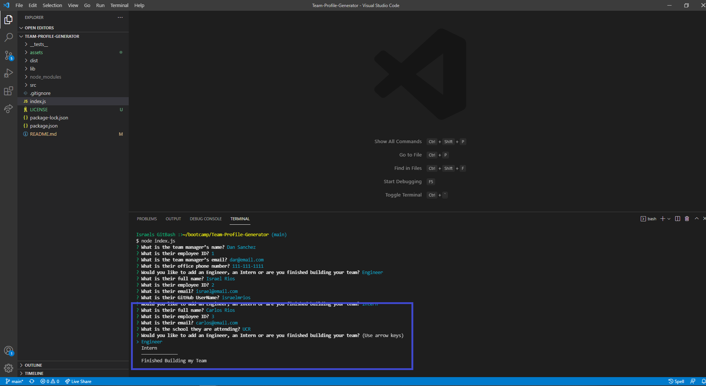
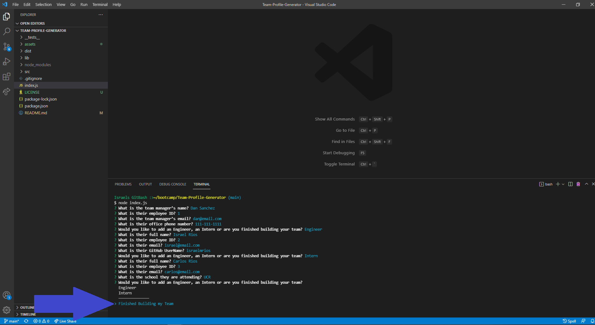
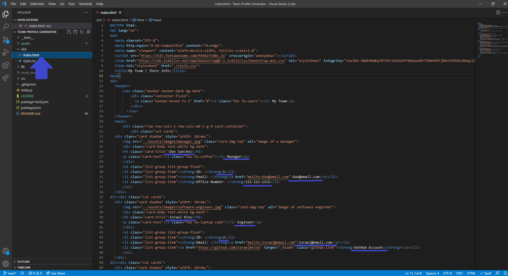
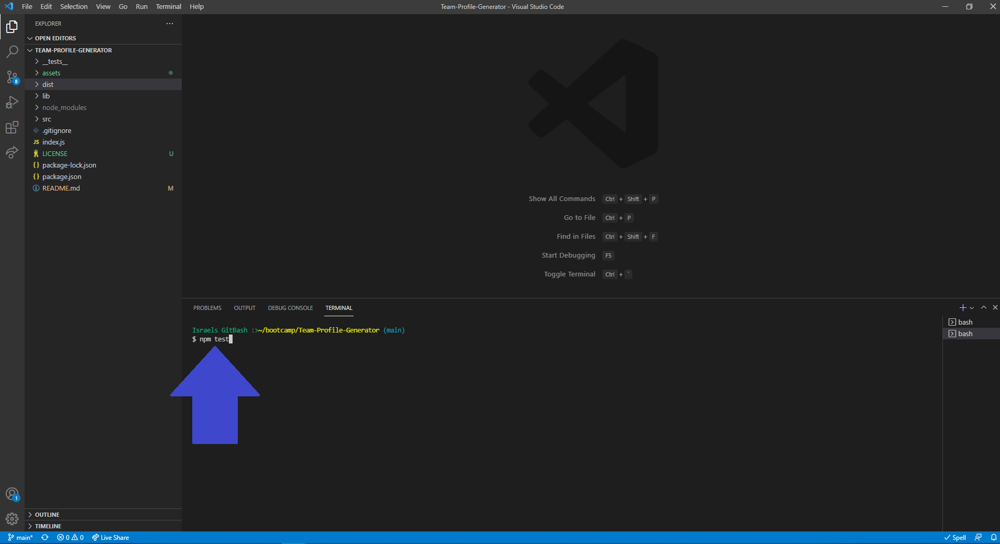
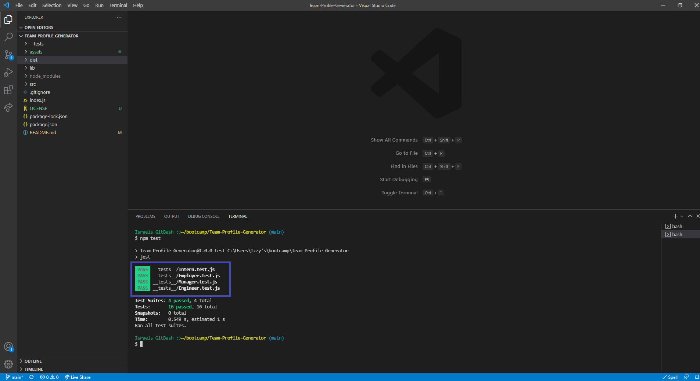

# Team-Profile-Generator


## Description
This application uses NodeJS and the command-line to generate an HTML webpage with Team Members Profiles. When the application starts it will ask for the team managers information and will then prompt you to add additional team members. After you select "Finished Building my Team" the application will take the inputs and create the HTML File. This application was written to help a team manager create a webpage with their team's basic profile information for quick accessability.

This project allowed me to continue practice using NodeJS. I learned how to implement and use multiple directory files. I also learned how to write and run test functions using *Jest*.

## Table of Contents
- [Installation](#installation)
- [Usage](#usage)
- [Contributing](#contributing)
- [Questions](#questions)
- [Tests](#tests)
- [License](#license)

## Installation
How to install this application and getting started:

* Clone the repo to your local machine
* Open the integrated terminal for the index.js file
* Run `npm install --y` which will install any dependencies

## Usage
You can view a Demo Video showing how to use this application by clicking on this link https://drive.google.com/file/d/1H1u_Ntc_CpDMR-tFS1DR-j9Upf75gGcz/view?usp=sharing.

### Step 1
* Invoke the following command on your integrated terminal:

```bash
node index.js
```


### Step 2
* When prompted add the team managers profile information including Office Number
* When prompted if you would like to add additional employees select: "Engineer", "Inter" or "Finished Building my Team" (for the purpose of the example select "Engineer")



### Step 3
* After selecting "Engineer" you will be prompted for their profile information including GetHub UserName
* When prompted if you would like to add additional employees select: "Engineer", "Inter" or "Finished Building my Team" (for the purpose of the example select "Intern")



### Step 4
* After selecting "Intern" you will be prompted for their profile information including the school they are attending
* When prompted if you would like to add additional employees select: "Engineer", "Inter" or "Finished Building my Team" (for the purpose of the example select "Finished Building my Team")




### Step 5
* After selecting "Finished Building my Team" you will see an *index.html* file was created under *src* folder
* Note: All the data entered was imputed in the HTML File
* Note: If you choose to run the application again it will overwrite your existing README file



## Contributing
There are many ways in which you can participate in this project, for example:

* Submit bugs and feature requests
* Review source code changes
* Review the documentation and make pull requests for anything from typos to additional and new content

## Questions
To find more information and the repository on this project please visit my [GitHub](https://github.com/israelmrios).

For any additional questions please email me [here](mailto:israelm.riosjr@gmail.com).

## Tests
Follow these steps to run the tests in the *__tests__* file:

* Open the integrated terminal for the index.js file
* Run `npm tests` which will begin testing the functions



## License
Copyright (c) 2021 Israel M Rios.
Licensed under the [MIT License](LICENSE).